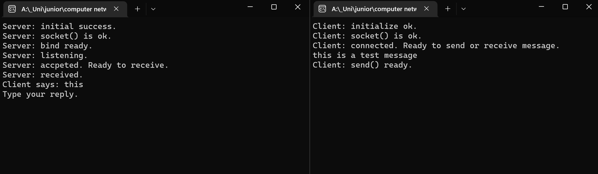
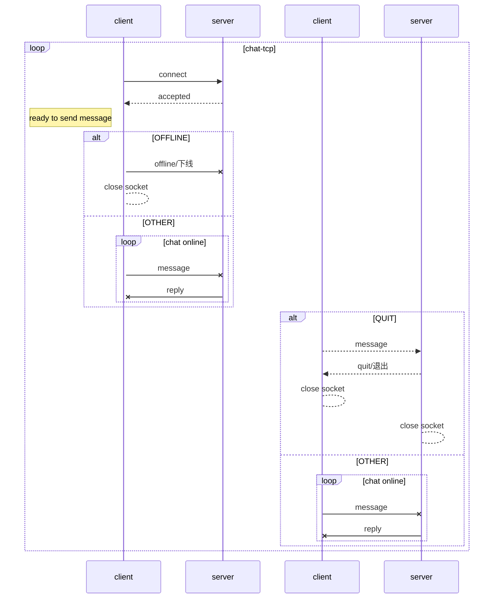
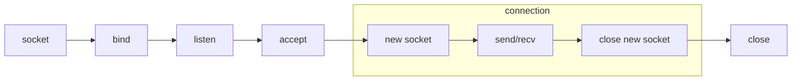
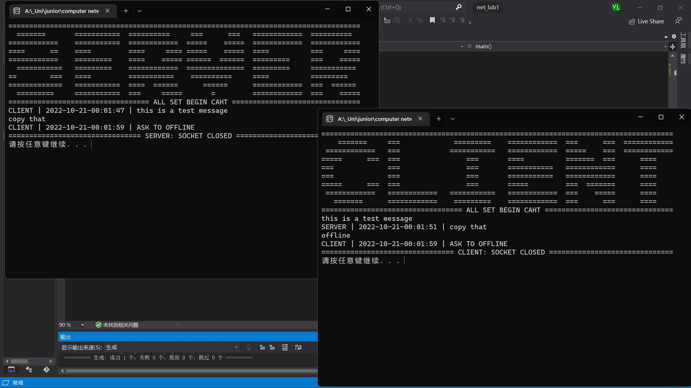
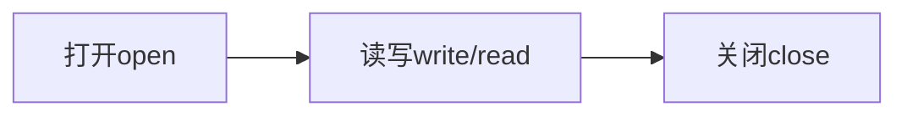

## 计算机网络实验报告

### Lab1

<center>学号： 2011839 &emsp; 姓名：刘扬&emsp; 专业：信安法</center>

#### 一、实验要求及分析

##### （一）实验要求

1） 使用流式Socket，设计一个**两人聊天协议**，要求聊天信息带有时间标签。请完整地说明交互消息的**类型、语法、语义、时序**等具体的消息处理方式。

2） 对聊天程序进行设计。给出模块划分说明、模块的功能和模块的流程图。

3） 在Windows系统下，利用C/C++对设计的程序进行实现。程序界面可以采用命令行方式，但需要给出使用方法。

4）对实现的程序进行测试。

5）撰写实验报告，并将实验报告和源码提交至本网站。

评分原则：

1）协议设计：25%

2）程序设计：25%

3）程序实现：25%

4）实验报告：25%

##### （二）实验分析

###### 1. 两人聊天协议 

实现自定义的应用层协议，包含：

+ 消息的类型：`request`, `response`
+ 消息的语法：包含字段、字段之间如何分割
+ 消息的语义：字段中信息代表的具体含义
+ 消息的处理：进程何时发送消息、收到消息后的动作等

###### 2.  聊天信息带有时间标签

可以使用时间戳timestamp，拼接到传输的消息前，构成【聊天信息带有时间标签】的效果。

#### 二、协议设计

##### 消息类型

+ quit（值为1）：退出聊天程序
+ offline：客户进程下线
+ other：除quit指令以外的其他内容，通常都认为是聊天内容，按照原字符输出

##### 消息语法

出现问题：聊天内容中空格后的字符无法被正常传输，如下图所示。说明消息类型需要进行转换才能成功在Client和Server之间进行传输。



``` C++
enum msgType {//消息的类型
	QUIT=1,
    OFFLINE,
	OTHER
};

struct msg {
	msgType type;
	string timestamp;//时间戳，放在传输消息中作为其一部分
	string content;//传输消息的内容
};
```

##### 消息语义

+ type: 表示消息的种类，分为QUIT, OTHER和OFFLINE三种。
  + QUIT只能由服务器发起。发起之后，先关闭服务器和客户连接的套接字，然后关闭客户套接字，最后关闭服务器套接字。如果客户端发起QUIT，则视为OTHER类型信息。
  + OFFLINE只能由客户发起。发起之后客户下线，服务器和客户连接的套接字关闭，随后客户的套接字关闭。（因为**客户进程可能为间歇性连接**）如果服务器发起OFFLINE，则视为OTHER类型信息。
  + OTHER表示其他类型的消息，在本程序中即为用户和服务器之间传输的消息内容。
+ timestamp：数据类型为string，表示消息的时间标签
+ content：数据类型为string，表示消息的内容，即用户使用键盘键入的聊天内容。

##### 消息处理

针对单线程的聊天程序，server和client一人输入一句，在对方输入过程中处于被动等待状态，等待对方的消息被成功接收之后才可以继续输入。时序自动判断。

server和client处理消息的方式类似，但client先发送消息、然后接收，而server则是先进入被动等待状态接收消息，然后才能发送。

###### 发送消息

发送消息时，通过键盘键入消息内容(`msg.content`)，判断该内容是否为输入的消息类型。

+ 如果是“quit”/“退出”，将`msg.type`赋值为`QUIT`；
+ 如果是“offline”/“下线”，将`msg.type`赋值为`OFFLINE`；
+ 如果都不是，则消息类型为`OTHERS`

此判断过程完成即`msg.type`赋值完成。

随后通过`time.h`中的函数获取消息键入的时间(`msg.timestamp`)，写入msg中。

使用函数将`msg`转换为`string`类型，以便能够放入`char[]`类型的`sendBuf`当中。

``` cpp
//method: msg to stirng
string mtos(msg m) {
	string s;
	if (m.type == QUIT)
		s = '1';
	if (m.type == OFFLINE)
		s = '2';
	else
		s = '3';
	s.append(" | ");
	s.append(m.timestamp);
	s.append(" | ");
	s.append(m.content);
	return s;
}
```

###### 收到消息

收到消息后先将`recvBuf`转换为`string`类型，再转换为`msg`类型，以便解读消息中的字段完成相应的动作。

``` cpp
msg stom(string s) {
	msg m;
	int pos = 4;//msg的type是pos=0,pos=1到pos=3是分割符号" | "
	if (s[0] == '1')
		m.type = QUIT;
	else {
		if (s[0] == '2')
			m.type = OFFLINE;
		else
		{
			m.type = OTHER;
		}
	}
	while (s[pos] != ' ') {
		pos++;
	}
	m.timestamp = s.substr(4, pos - 4);
	m.content = s.substr(pos + 3);
	return m;
}
```

随后判断消息类型，如果为`QUIT`，则连接套接字关闭，client和server都退出，同时显示是server请求退出，并输出时间标签；如果是`OFFLINE`，则只有请求的client退出，显示client请求下线并输出时间标签。如果是`OTHER`，则将消息的时间标签和内容部分输出。



#### 三、程序设计

##### 1. 模块

以下为client的模块：


以下为server的模块：



##### 2. 模块划分说明

###### client

+ socket： 初始化socket dll，指定使用的socket版本，建立套接字，并绑定到一个特定的传输层服务
+ connect：向一个特定的socket发送建立连接的请求
+ send/recv：发送和接收数据
+ close：关闭client套接字，释放socket dll资源

###### server

+ socket： 初始化socket dll，指定使用的socket版本，建立套接字，并绑定到一个特定的传输层服务
+ bind：将一个本地地址绑定到制定的socket
+ listen：让套接字进入监听状态，监听是否有远程连接。
+ accept：接受一个特定套接字请求等待队列中的连接请求
+ new socket：为client和server的连接进程建立一个套接字
+ send/recv：发送和接收数据
+ close new socket：关闭连接进程的套接字
+ close：关闭server套接字，释放socket dll资源

#### 四、程序实现

###### bind

```cpp
sockaddr_in  addr;
	memset(&addr, 0, sizeof(sockaddr_in));
	addr.sin_family = AF_INET;//IPv4
	addr.sin_port = htons(PORT);//host to network short. 7171 is the listening port
	addr.sin_addr.S_un.S_addr = inet_addr(IP_ADDR);//也可以使用inet_pton

bind(sockServer, (SOCKADDR*)&addr, sizeof(addr));
```

###### connect

```cpp
sockaddr_in addrServer;////assume server's IP address is 127.0.0.1 (localhost)
	addrServer.sin_family = AF_INET;//IPv4
	addrServer.sin_port = htons(PORT);
	addrServer.sin_addr.S_un.S_addr = inet_addr(IP_ADDR);

connect(sockClient, (SOCKADDR*)&addrServer, sizeof(addrServer));
```

###### listen & accept&new socket

``` cpp
listen(sockServer, 5);
sockaddr_in addrClient;
int lenClient = sizeof(addrClient);
SOCKET sockConn = accept(sockServer, (SOCKADDR*)&addrClient, &lenClient);
```

server和client的初始化、close大多相同，就不在实验报告中一一展示。以下展示server在socketConn中判断消息类型、获取消息时间标签、填充消息内容的实现代码。

``` cpp
			char input[BUFLEN];
			cin.getline(input, BUFLEN);
			sendMsg.content = input;
			if (strcmp(input, "quit") == 0 || strcmp(input, "退出") == 0) {
				sendMsg.type = QUIT;
			}
			else {
				if (strcmp(input, "offline") == 0 || strcmp(input, "下线") == 0) {
					sendMsg.type = OFFLINE;
				}
				else
					sendMsg.type = OTHER;
			}
//add timestamp to sendBuf
			struct tm stime;
			time_t now = time(0);
			localtime_s(&stime, &now);

			char tmp[32] = { NULL };
			strftime(tmp, sizeof(tmp), "%Y-%m-%d-%H:%M:%S", &stime);
			sendMsg.timestamp = tmp;

			strcpy_s(sendBuf, mtos(sendMsg).c_str());
```

client的实现也与server大同小异，但因为client是主动请求连接的一方，所以两者实现接收信息的逻辑顺序略有差异。

最终效果如下，单线程的Server和Client之间进行聊天。输入`quit`或是`退出`都可以退出该聊天程序。



#### 五、实验总结

##### 对socket的理解：

将socket看成一个特殊的文件，它遵循文件操作的模式：



在设计模式当中，socket作为一个“门”，把复杂的TCP/IP协议隐藏在其后，让用户可以通过socket接口去组织数据、符合TCP/IP协议。

##### 对应用层协议的理解：

应用层协议将需要传输的消息分为多个部分，并通过对不同部分的解读做出不同的操作。以HTTP协议为例，HTTP协议具有HTTP消息头、请求方式（`GET, POST, TRACE`等）、状态码（用来表示特定的 HTTP 请求是否已成功完成，分为五类：消息响应，成功响应，重定向，客户端错误和服务器错误）等部分。

#### 六、参考

1. [socket--socket()、bind()、listen()、connect()、accept()、recv()、send()、select()、close()、shutdown() ](https://www.cnblogs.com/straight/articles/7660889.html)
2. [SOCKETS - SERVER & CLIENT - 2020](https://www.bogotobogo.com/cplusplus/sockets_server_client.php)
3. [网络协议分析](https://www.jianshu.com/p/15dcfcc1d7af)
4. [C++格式化日期和时间戳](https://www.jianshu.com/p/f50324284592)
5. [C++实现简单的网络聊天程序](https://www.cnblogs.com/wangp19/p/12001884.html)
3. [HTTP - MDN Web Docs - Mozilla](https://developer.mozilla.org/zh-CN/docs/Web/HTTP)