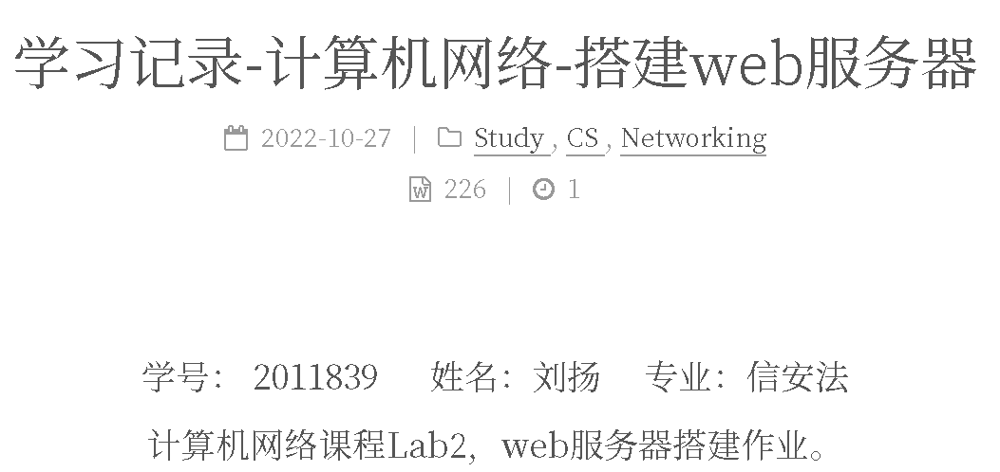
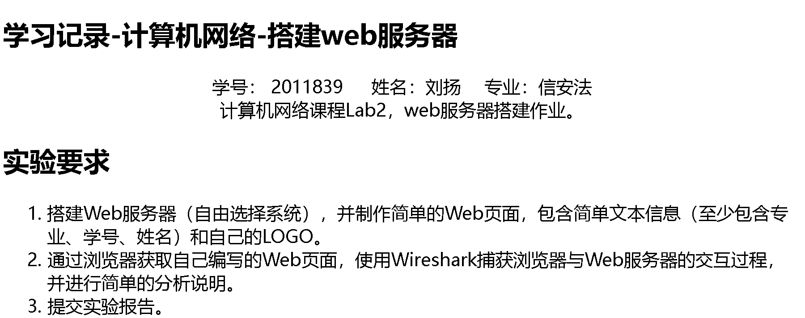
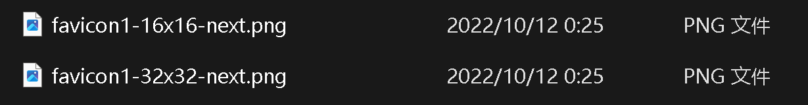
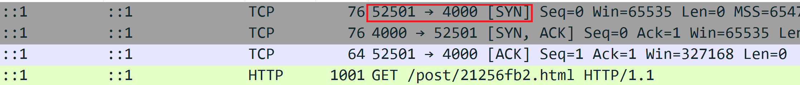
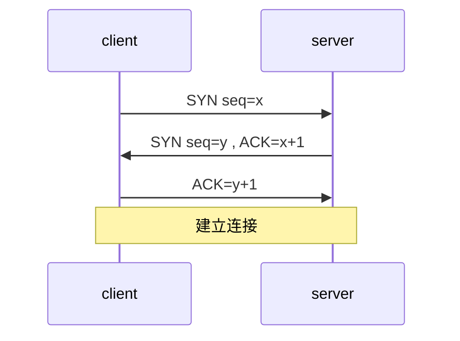
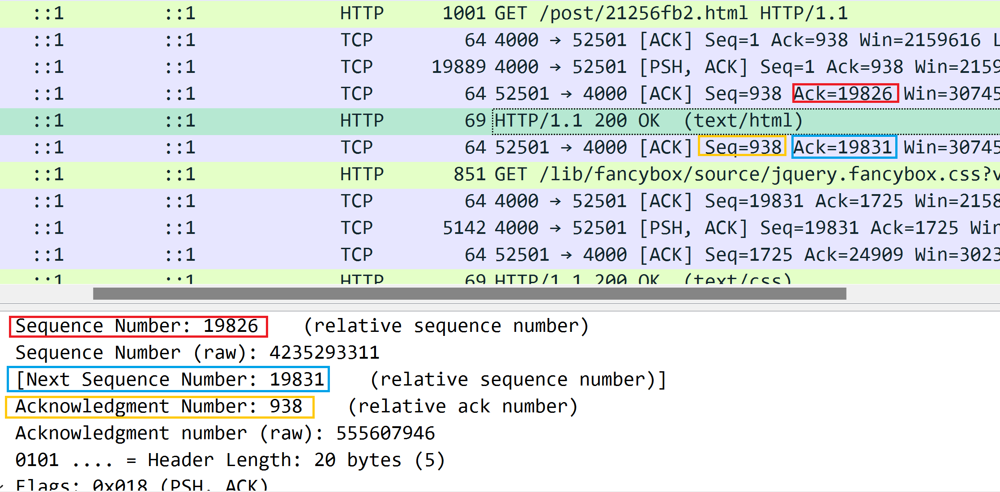
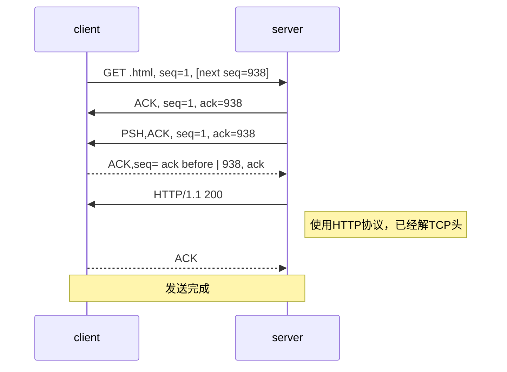
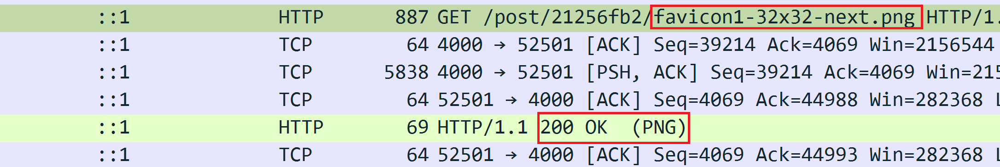
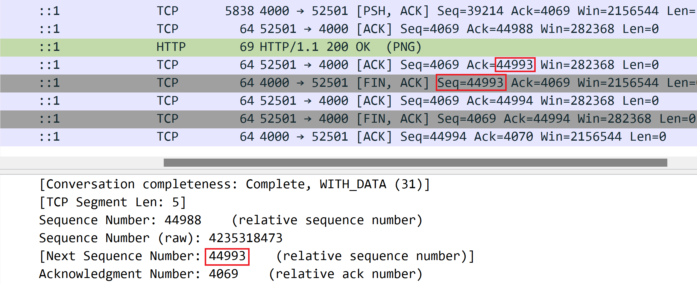
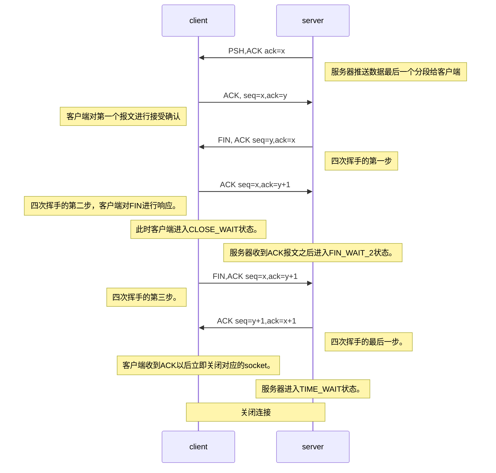

<h1><center>计算机网络实验报告</center></h1>

<h3><center>Lab2</center></h3>

<center>学号： 2011839 &emsp; 姓名：刘扬&emsp; 专业：信安法</center>


## 一、功能实现

### （一）Web服务器搭建

本次实验使用hexo框架进行web服务器的搭建（github的绑定是为了更好地将其进行DNS的部署以及自定义域名的绑定）

#### 将文件传输到github上

+ 直接将远程仓库克隆到本地
+ create file in web github then commit to the local 仓库
+ 将本地仓库的内容push到远程仓库

<!--more-->

``` git
git status 查看仓库状态
git log 查看提交日志
```

```
git clone <url of file to be cloned> 将github上的文件克隆到本地
```

```
git add <file> 将本地仓库中的文件添加到缓冲区
```

```
git commit -m "caption of the commit" 将缓冲区的文件提交到仓库中，注释不能为空
```

``` git
git push origin main 将本地仓库提交到远程仓库
```

#### 安装node.js

#### 安装hexo框架

新建blog文件夹，在该文件夹中打开git bash，使用`npm install -g hexo-cli`命令进行安装

然后对hexo进行初始化，使用命令行`hexo init`

输入`hexo g`进行网页文件生成，使用`hexo s`可以对网页进行静态部署。

打开`http:\\\localhost:4000\`就可以查看生成的网页，并进行相应的调试。

退出后修改/Blog/_config.yml

``` yaml
deploy:
  type: git
  repository: git@github.com:YOURNAME/YOURNAME.github.io.git
  branch: main
```

在git bash窗口中以此输入以下命令：

```
hexo clean
hexo g
hexo d
```

然后再在浏览器中输入`https://YOURNAME.github.io`即可看到个人博客的主页

注意：YOURNAME.github.io这个repository的名字必须与github用户名相同，否则会返回404

#### 绑定域名

##### 1.载入CNAME文件

在/Blog/resource文件夹中新建CNAME文件，在其中写上自己的域名。

使用`hexo g, hexo d`命令进行重建

##### 2.在DNS中添加记录

使用ping在cmd中解析ipv4地址

```
ping YOURURL
```

在godaddy中加入两条DNS记录

```
A @ IPV4
CNAME www YOURURL
```

然后可以在github中查看域名是否已经绑定，等待DNS部署，绑定成功即可访问

### （二）HTML界面的编写

HTML文档应当使用`<!DOCTYPE html>`开头，并用`</html>`结尾，其中包含`<head>, <title>, <body>...`等多个部分。使用`<div> </div>`可以把网页的不同部分放进对应的网格之中。

#### 简单的文本信息

标题取名为“学习记录-计算机网络-搭建web服务器”。

```html
<title>学习记录-计算机网络-搭建web服务器 | Empty the Drawer</title>
```

在article的部分加入学号、姓名等信息。

``` html
<div class="post-body" itemprop="articleBody">
<center>学号： 2011839 &emsp; 姓名：刘扬&emsp; 专业：信安法 </center>
</div>
```

还可以在html的结尾包含一些jquery的库用来实现更多功能。同样，也可以在html文档开头加入一些link来实现css的样式部署以及整体的字体替换等。

最终呈现效果如下：



由于仅一个html没有搭载js或css的其他库，故在本地该文档会呈现以下效果：



#### 包含自己的Logo

将logo文件放在/images/目录下，然后使用`href`的超链接来进行包含即可。



``` html
<link rel="icon" type="image/png" sizes="32x32" href="/images/favicon1-32x32-next.png?v=5.1.4">
<link rel="icon" type="image/png" sizes="16x16" href="/images/favicon1-16x16-next.png?v=5.1.4">
```

最终可以在网页的bar上呈现效果。


也可以将logo作为图片插入

``` html
<p></p>
```

## 二、Wireshark捕获交互文件

在git bash中输入`hexo s`命令，表示将编写好的页面静态部署到本地的web服务器上。静态部署完成过后会看到该页面被服务器自动赋值了一个随机生成的网址，即`http://localhost:4000/post/21256fb2.html`，从该网址可以获得以下信息：

1. Web服务器在本地运行，故其为`localhost`
2. 该界面使用http协议
3. 该服务器使用localhost的`4000`端口。
4. 该界面的文本格式是html

使用Wireshark捕获交互文件，由于我们已经知道了服务器端口为4000，故使用`tcp.port==4000`来进行过滤。从头观察抓包的内容。

`SYN`意为建立联机，`ACK`意为确认。可以看到客户端的端口是52501（由于本实验中的网页会调用众多库、导致打开其他客户端界面，所以我们基于此将过滤器设为`tcp.port==4000&&tcp.port==52501`，保证只看到编写界面和服务器之间进行的交互过程）。

### 1. 三次握手-建立连接

以下截图展现了TCP的三次握手协议：①客户端先向服务器请求建立联系（SYN包），②随后服务器发送SYN和ACK包表示确认建立联系；③之后客户端发送ACK包表示确认建连。随后客户端使用HTTP协议请求从打开`/post/21256fb2.html`这个界面，HTTP的协议版本是1.1 



以下时序图展现了TCP建立连接中客户端和服务器发送报文、序列号变化的过程，其中x,y都是随机赋值的，但在建立连接的过程中通常为0。



### 2. 数据传输

当客户端发送了HTTP协议的`GET`请求之后，可以看到服务器做出了应答：首先是确认；随后发送`PSH`包，打开具体消息可以确认发送的信息即为页面的html文档，并且包含了HTTP协议头`HTTP/1.1 200`，这些信息都被打包到TCP segment中进行发送。





当客户端发送了`PSH`包之后，客户端发送`ACK`包表示确认收到。随后是从服务器到客户端使用HTTP协议指令发送页面的文本内容(text/html)，此步应当为之前TCP segment内容的解封装。服务器发送之后客户端会再次使用TCP发送`ACK`包表示确认收到。

同样的，html文档中包含的css样式或是其他文件也会使用三次握手协议→`GET`→发送TCP segement→解TCP segment的流程进行发送。

客户端请求图片的时候，会先发送一个HTTP协议的`GET`请求，服务器接收到以后就会发送`ACK`并且发送含有图片的数据包；客户端会发送`ACK`，随后服务端会发送一个HTTP协议数据包，返回值为200表明页面可以正常加载。



### 3. 四次挥手-断开连接

本过程与课程讲授内容略有区别，基于实验课要求将按照Wireshark捕获的包进行分析而非按照课程讲授的四次挥手过程进行分析。



关闭请求的时序图如下图所示：



## 三、参考

+ [TCP状态机：当服务端主动发FIN进TIME_WAIT，客户端源端口复用会发生什么 ](https://www.cnblogs.com/yurang/p/12154453.html)